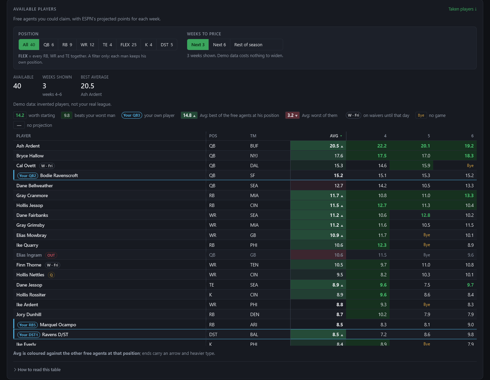
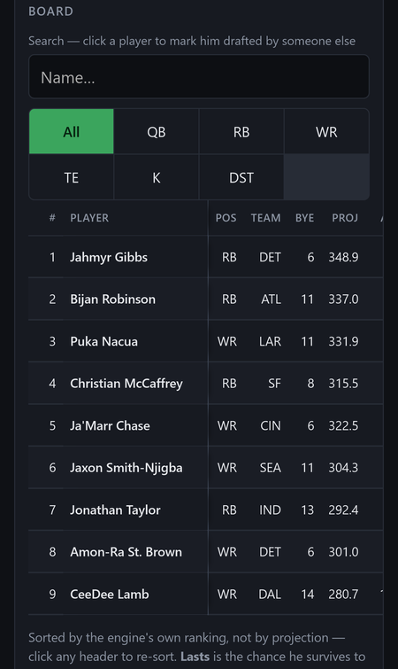
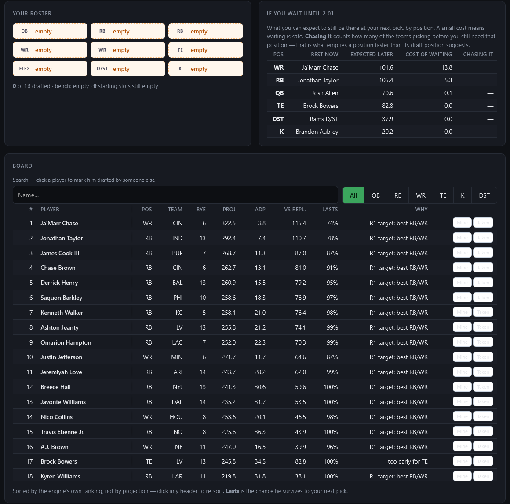
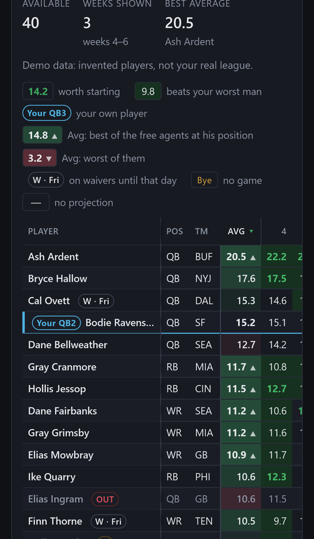

# Fantasy Football

A companion site for an ESPN fantasy football league. It fills the gaps in ESPN's app: a practice
draft room with a pick assistant, a trade finder ranked by your chance of winning the title, season
simulations, luck-vs-skill stats and a sortable waiver wire. It opens on a built-in demo league, so
you can look around without connecting anything.

**[▶ Open the live site](https://timothyhadfield.github.io/fantasy-football/)** · works on phone and laptop

  
  &nbsp;
  

  
  &nbsp;
  

Screenshots: the practice draft room (real 2026 preseason projections) and the Players page on demo data (invented players).

## Features
- **Draft room** — run a practice draft against nine computer managers (casual, normal or sharp), or follow your real ESPN draft. On every pick it recommends a player, shows the chance he lasts to your next pick, what each position costs you if you wait, and warns about runs and tier drops.
- **Trade finder** — searches one- and two-player deals with every team and ranks them by how much they raise your chance of winning it all (or of not finishing last), times the chance the other manager says yes. Trades are priced week by week against each lineup, not on season averages.
- **Season simulation** — plays the rest of the season and the playoffs out thousands of times for each team's win chances, expected wins and title odds.
- **League stats** — record, scoring, luck and skill per team, with one red-to-green colour scale so outliers stand out.
- **Roster analysis** — every team's best lineup and bench side by side, for any week or averaged over the season.
- **Players page** — free agents and rostered players with ESPN's projections for the next 3 or 6 weeks or the rest of the season, filterable by position.
- **Weekly summary** — each manager's luck, title chance and last-place chance as a chart you can share in the group chat.
- **Time machine** — saves each week's projections as they stand (ESPN keeps no history), so you can see any page as it looked in an earlier week.

## Built with
Plain HTML, CSS and JavaScript with no build step, reading ESPN's fantasy API. A small Chrome extension (`extension/`) connects a private league without making it public, and Firebase (Google sign-in + Firestore) carries a league's copy from the laptop to the phone. Headless test suites in `tests/` run on GitHub Actions before each GitHub Pages deploy.

## For developers
- **Run it locally:** serve the folder (for example `python -m http.server 8765`) and open `http://127.0.0.1:8765`. It needs a server because the pages use ES modules.
- **Tests:** `cd tests && npm install && npm test` — see [tests/README.md](tests/README.md).
- **Project state and rules:** [PROGRESS.md](PROGRESS.md) is the current state and the rules that must not be broken; [AUDIT.md](AUDIT.md) is the open work queue; [DRAFT-STRATEGY.md](DRAFT-STRATEGY.md) explains the draft assistant; `docs/` holds plans and research (ESPN API notes, Firebase setup).
- **Private leagues:** load `extension/` as an unpacked extension in Chrome. Phone sync setup: [docs/firebase-setup.md](docs/firebase-setup.md).
